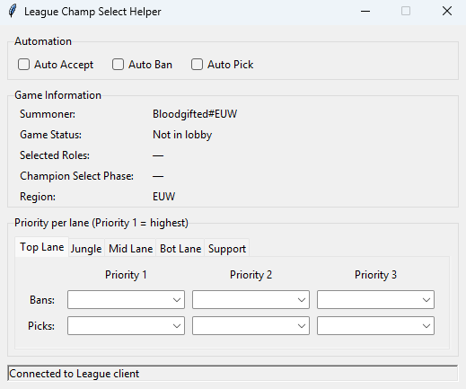

# League Champ Select Helper

A small Windows tool with a checkbox GUI that automates the League of Legends
champion-select flow via the **LCU API** (the local REST/WebSocket API the
League client exposes on your own machine).



## Features

- **Auto Accept** the ready-check when a match is found.
- **Auto Ban** a champion based on your assigned lane.
- **Auto Pick** a champion based on your assigned lane.
- **Live Game Information** panel showing summoner name#tag, current gameflow
  phase, queue mode, selected roles, champ-select phase, and region.
- **Tabbed priority editor** - one tab per lane (Top / Jungle / Mid / Bot /
  Support), each with 3 ban priorities and 3 pick priorities on separate rows.
- **Searchable champion dropdowns** - start typing to filter (e.g. `kai` →
  Kai'Sa); case-insensitive prefix match resolves on focus-out.

Bans and picks use an **ordered priority list per lane** (5 lanes × 3 ban
priorities × 3 pick priorities). Priority 1 is highest; the tool bans/picks
the first champion in the list that is still available.

> The app only talks to the League **client** through the client's own local
> API (auth is read from the client `lockfile`). It does **not** read or
> modify the game, memory, or network traffic.

## Terms of Service

Riot's Terms of Service prohibit third-party automation of the client. Even
though this is a personal convenience tool that gives no in-game advantage,
using it carries a risk of account action. Use it at your own risk.

## How it works

- [`lcu-driver`](https://github.com/sousa-andre/lcu-driver) discovers the
  running client via its `lockfile`, authenticates, and delivers WebSocket
  events.
- On a **ready-check** event → `POST /lol-matchmaking/v1/ready-check/accept`.
- On a **champ-select session** event → read your `assignedPosition`, find your
  in-progress ban/pick action, choose the top available champion from your
  list, and `PATCH /lol-champ-select/v1/session/actions/{id}` with
  `completed: true`.
- The Game Information panel is populated from `/lol-summoner/v1/current-summoner`,
  `/riotclient/region-locale`, `/lol-gameflow/v1/session` (WebSocket), and
  `/lol-lobby/v2/lobby` (WebSocket).
- Champion names for the dropdowns come from Riot's Data Dragon and are cached
  to `champions.json`.

## Run from source (Windows, with the client installed)

Requires Python 3.10+ (3.12/3.14 tested).

```bat
python -m pip install -r requirements.txt
python main.py
```

Pick your priorities per lane, tick the automation checkboxes. Settings save
automatically to `config.json` next to the script.

## Build the `.exe`

If you want to build it yourself, run on Windows:

```bat
build.bat
```

Output: `dist\LeagueChampSelectHelper.exe` - a standalone executable that runs
without Python installed.

`build.bat` will kill any already-running instance of the helper first, so
repeated rebuilds work without manual cleanup.

## Download & Run

Alternatively, you don't need to install Python or build anything. Grab
`dist\LeagueChampSelectHelper.exe` from this repository and double-click it -
that's it.

- Settings save to `%APPDATA%\LeagueChampSelectHelper\` (paste that path into
  Explorer to open the folder).
- Open the League client first; the helper connects automatically when the
  client is running.

## Notes

- If PyInstaller fails with a `psutil` / `AccessDenied` error, run
  `python -m pip install -U psutil` and rebuild (a known `lcu-driver` quirk).
- Auto-pick/ban only trigger when you have an **assigned lane** (e.g. ranked
  or draft). In blind pick or custom games there is no `assignedPosition`, so
  the tool stays out of the way.
- Python 3.12+ compatibility: the LCU connector is constructed on the worker
  thread (not on import) so that `asyncio.get_event_loop()` finds a loop -
  older Python auto-created one, 3.12+ raises without an explicit set-up.
